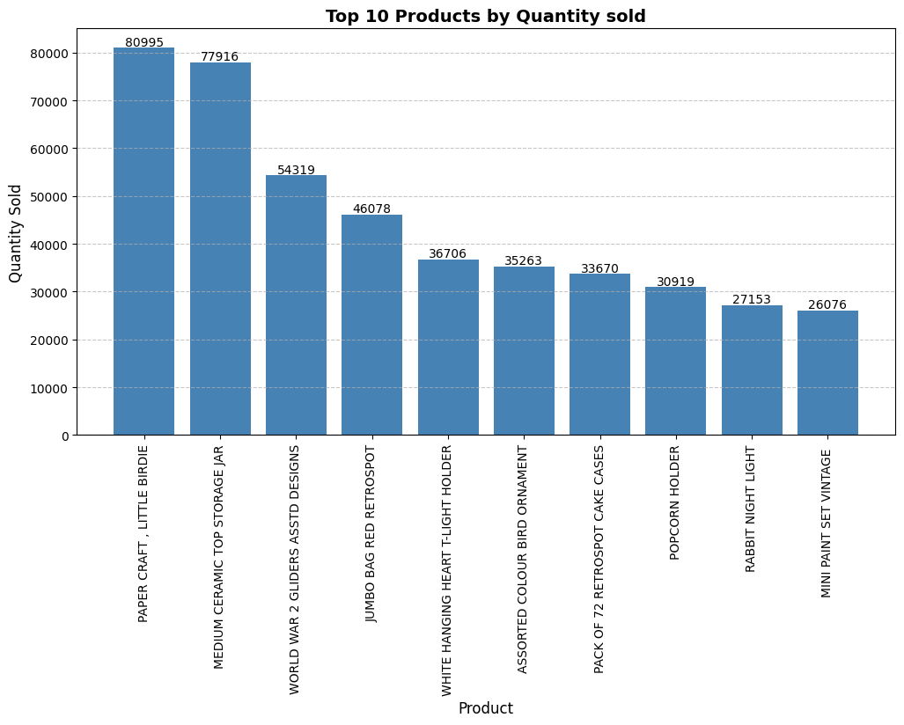
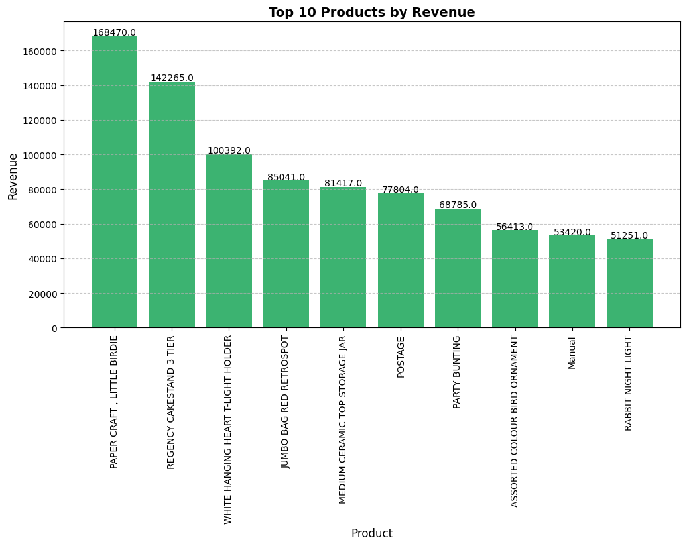
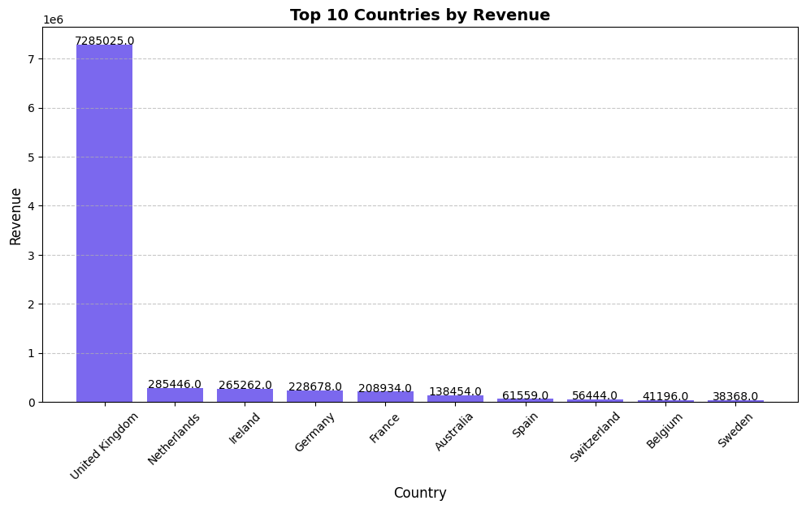
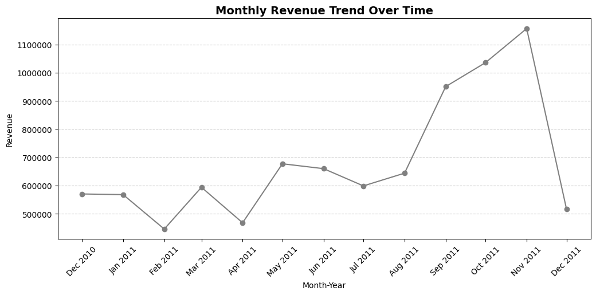
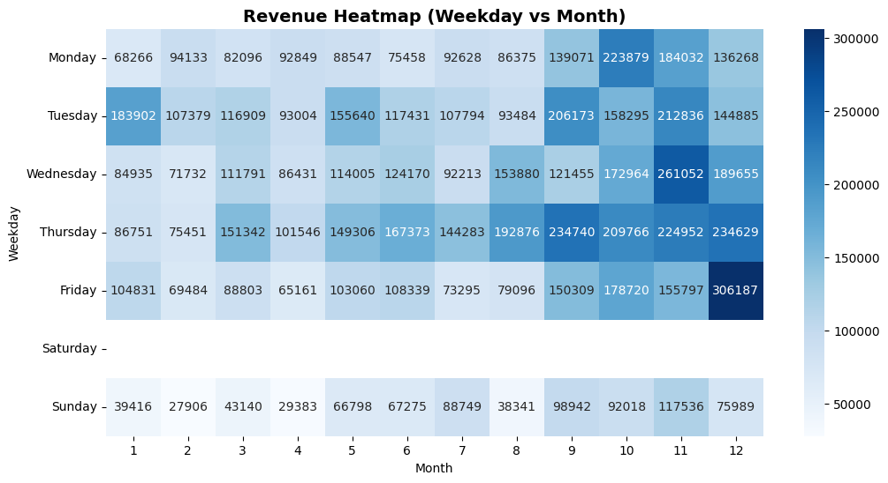
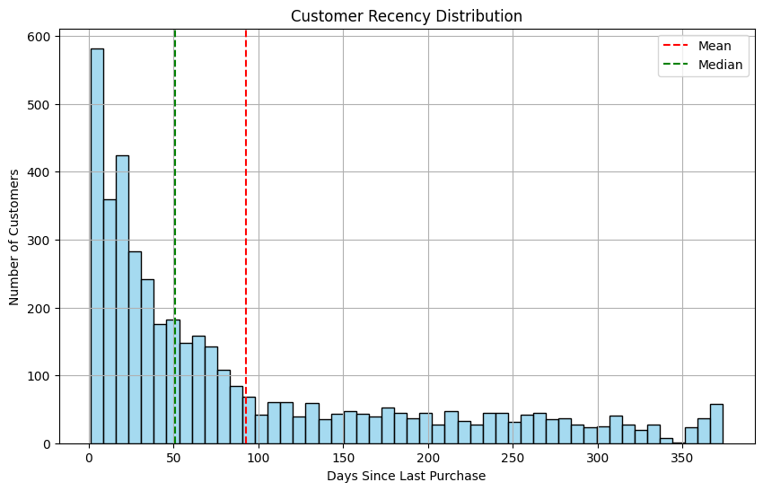
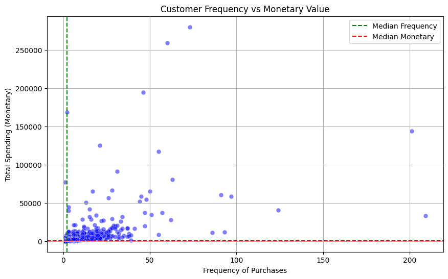
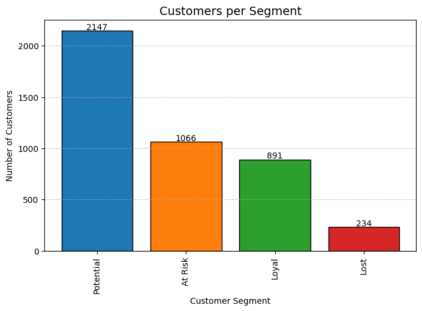
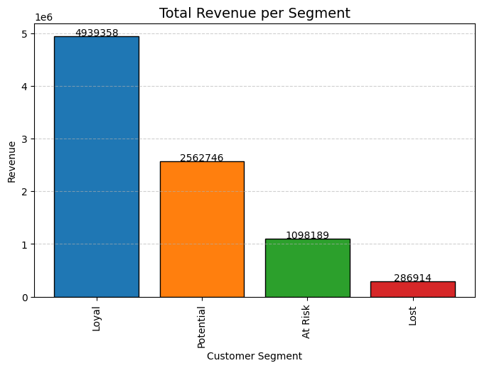
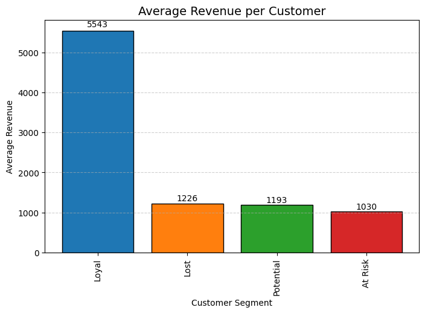

# Customer-Purchase-Analysis-Project

Analyzing customer purchase behavior and product sales trends using Pandas, Matplotlib, and Seaborn.

---

## About This Project
This project explores an online retail dataset to understand customer purchasing patterns and overall sales performance.

It is built step by step as part of my Data Analytics learning journey.

---

## Dataset
This project uses the Online Retail dataset from the UCI Machine Learning Repository:  
https://archive.ics.uci.edu/ml/datasets/online+retail  

The dataset contains transactional data from a UK-based online retail store (2010–2011).

### It includes:
- Invoice numbers  
- Product (Stock) codes  
- Product descriptions  
- Quantities purchased  
- Unit prices  
- Customer IDs  
- Country information  

During analysis, missing values were identified and handled appropriately.

---

## 🛠 Tools Used
- Pandas – data cleaning, feature extraction, and analysis  
- Matplotlib – visualizations and charts  
- Seaborn – advanced visualizations  
- Jupyter Notebook – workflow and analysis  
- VS Code – development  
- Git & GitHub – version control and project hosting  

---

## Skills Demonstrated
- Data Cleaning and Preprocessing  
- Exploratory Data Analysis (EDA)  
- Data Visualization  
- Customer Segmentation (RFM Analysis)  
- Business Insight Generation  

---

## Day 1 – Basic Exploration
- Loaded the dataset  
- Explored structure and data types  
- Generated summary statistics  
- Checked for missing values  

---

## Day 2 – Data Cleaning & Preparation
- Removed missing values  
- Removed negative quantity transactions (returns)  
- Removed zero UnitPrice rows  
- Removed duplicate records  
- Converted InvoiceDate to datetime  
- Extracted Year, Month, Weekday, Hour  
- Created TotalPrice column  
- Verified unique customers (4,338) and countries (37)  
- Replaced EIRE with Ireland  

---

## Day 3 – Sales Insights & Visualization

### Top Products by Quantity
  
Shows which products are sold the most in terms of quantity.

### Top Products by Revenue
  
Indicates that a small number of products generate the majority of revenue.

### Top Countries by Revenue
  
Highlights which countries contribute most to overall sales.

---

## Day 4 – Time-Based Sales Analysis

### Monthly Revenue Trend
  
Shows seasonal trends and peak revenue months.

### Sales Heatmap (Month vs Weekday)
  
Displays how sales vary across months and days of the week.

---

## Day 5 – RFM Customer Analysis

### Recency Distribution
  
Most customers are recent, indicating active engagement.

### Frequency vs Monetary
  
Identifies high-value customers who purchase frequently and spend more.

### Observations:
- Most customers purchase only a few times  
- A small group contributes high revenue  
- Some customers may need re-engagement  

---

## Day 6 – RFM Customer Segmentation & Business Metrics

### Customer Count per Segment
  
Shows distribution of customers across segments.

### Total Revenue per Segment
  
Loyal customers contribute the highest revenue.

### Average Revenue per Customer
  
Loyal customers have the highest spending per person.

### Observations:
- Most customers are **Potential** → can be converted to Loyal  
- **Loyal customers** drive most revenue  
- **At Risk customers** can be re-engaged  
- **Lost customers** contribute very little  
